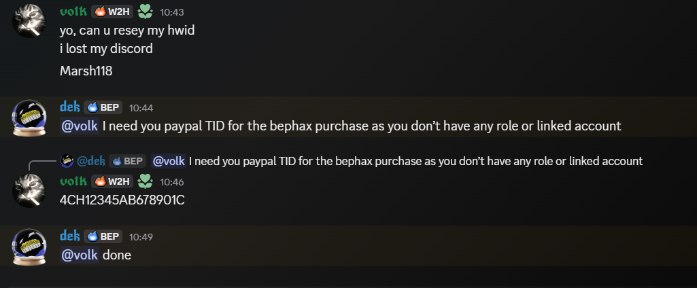

# BepHax

---

## Requirements

### Required

- [Fabric Loader](https://fabricmc.net/use/installer/)
- [Fabric API](https://modrinth.com/mod/fabric-api)
- [Meteor Client](https://meteorclient.com)
- [Xaero's Minimap](https://modrinth.com/mod/xaeros-minimap)
- [Xaero's World Map](https://modrinth.com/mod/xaeros-world-map)
- [XaeroPlus](https://modrinth.com/mod/xaeroplus)
- Java

Get every mod for your own Minecraft version.

### Optional

| Mod | Enables |
|:---|:---|
| [Baritone](https://modrinth.com/mod/baritone) / Baritone Meteor | `miner`, auto navigation |
| [Litematica](https://modrinth.com/mod/litematica) + [MaLiLib](https://modrinth.com/mod/malilib) | `printer`, `printer-materials` HUD |

---
